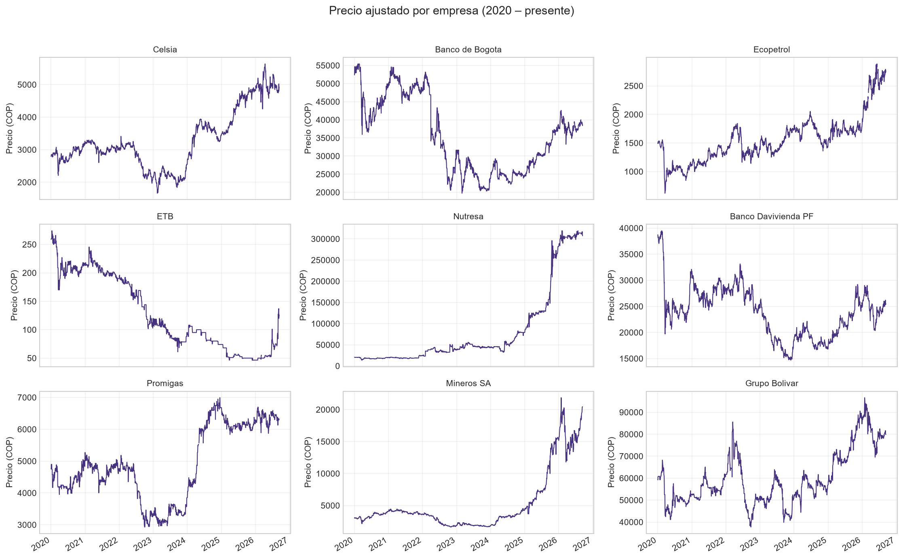
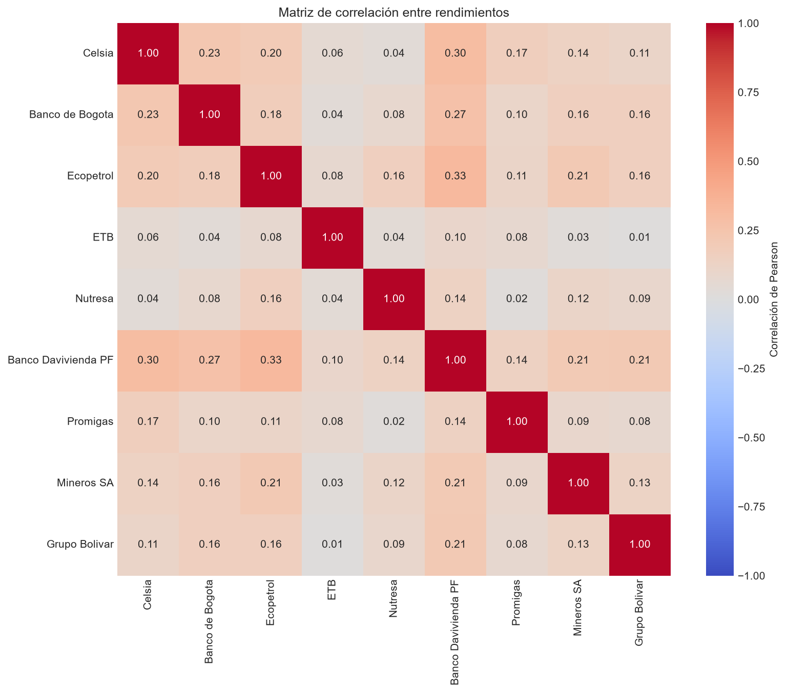
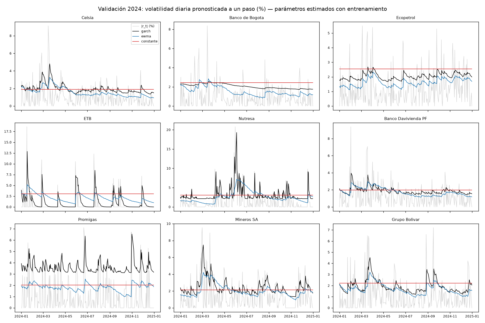
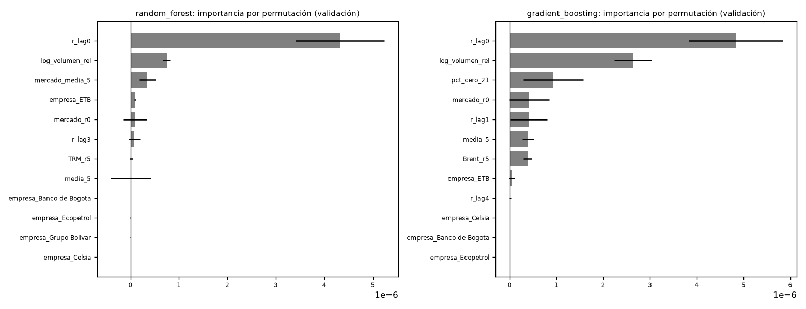
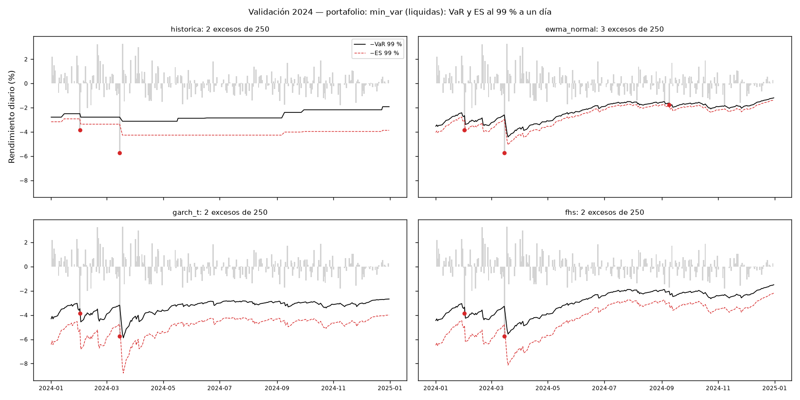
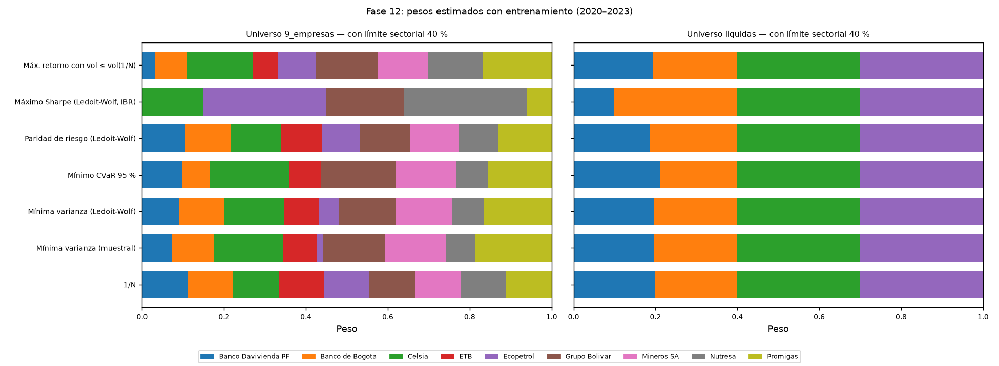
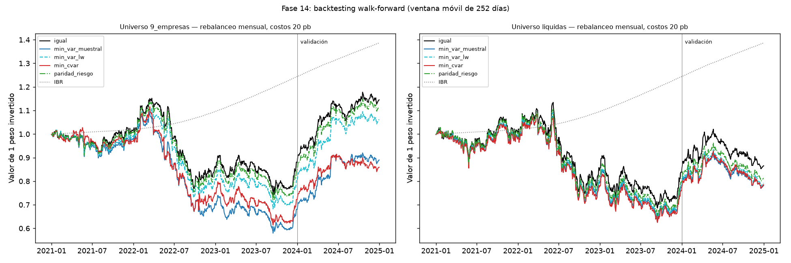
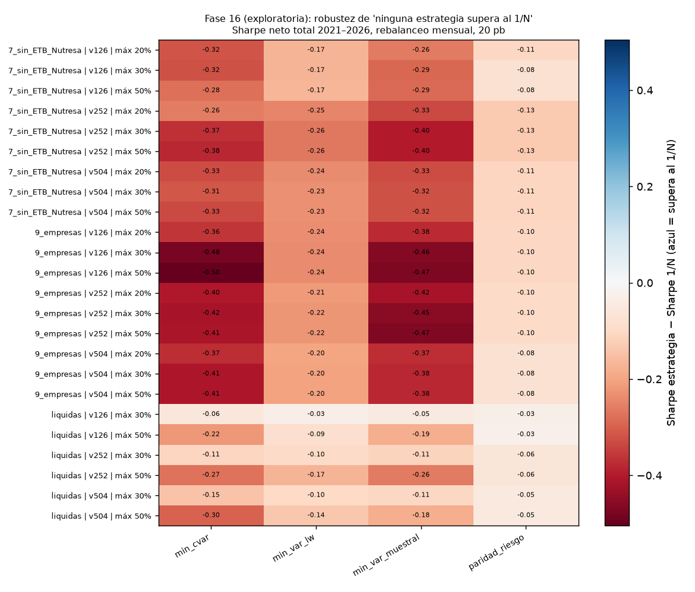
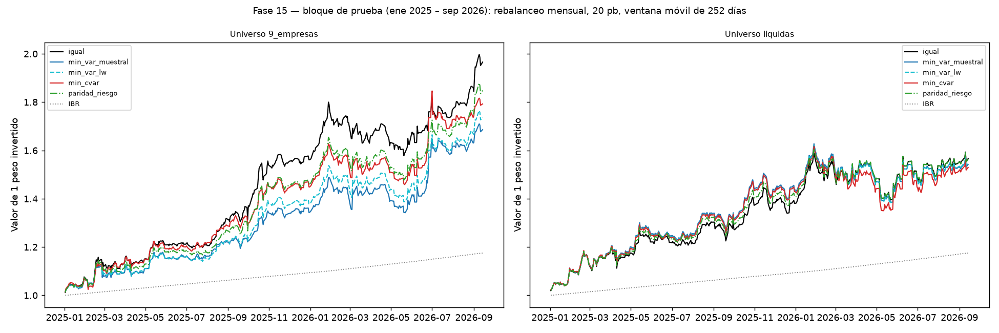
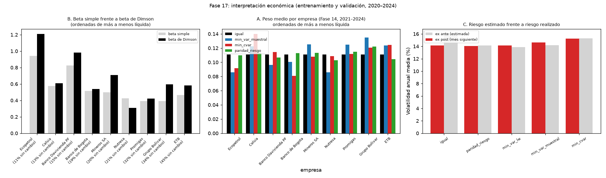

# Econometría, aprendizaje automático y redes neuronales para portafolios de acciones colombianas: una evaluación fuera de muestra con protocolo preregistrado

**Autores:** Gabriel Aldana, Harold Fúneme, Laura Rodríguez, Juan Roa

**Institución:** [Institución]

**Fecha:** octubre de 2026

## Resumen

Este trabajo compara modelos econométricos (ARIMA, GARCH, HAR), de aprendizaje automático (Random Forest, Gradient Boosting) y redes neuronales (MLP, LSTM) para pronosticar el rendimiento y la volatilidad de nueve acciones de la Bolsa de Valores de Colombia entre enero de 2020 y septiembre de 2026. También compara la estimación del riesgo (VaR y Expected Shortfall) y la construcción de portafolios con restricciones realistas. La muestra se dividió en el tiempo: entrenamiento (2020–2023), validación (2024) y un bloque de prueba (enero de 2025 a septiembre de 2026, 426 días) que permaneció cerrado hasta una única evaluación final. Las hipótesis de esa evaluación se registraron por escrito antes de abrirlo. Las comparaciones usan pruebas de Diebold-Mariano, el Model Confidence Set y la corrección de Holm por comparaciones múltiples.

Cuatro resultados se sostienen fuera de muestra y en el análisis de robustez:

1. Ningún modelo pronostica el rendimiento diario mejor que la media histórica de forma estadísticamente distinguible, incluidas las redes neuronales.
2. La volatilidad sí es predecible, y el promedio móvil exponencial (EWMA), que no estima parámetros, es una referencia difícil de superar.
3. El VaR con distribución normal subestima el riesgo extremo; la simulación histórica filtrada está mejor calibrada.
4. Ninguna estrategia de optimización basada en riesgo supera al portafolio de igual ponderación (1/N).

El proyecto incluye además un agente de IA de investigación que consulta y verifica el trabajo sin poder modificarlo. En una evaluación con siete escenarios cumplió 38 de 39 criterios, sin ninguna violación de integridad.

**Palabras clave:** mercado colombiano, pronóstico de volatilidad, redes neuronales, Value at Risk, portafolio 1/N, evaluación fuera de muestra, preregistro.

## 1. Introducción

La literatura y la práctica financiera reciente ofrecen modelos cada vez más complejos para pronosticar precios y construir portafolios: desde los modelos econométricos clásicos hasta métodos de aprendizaje automático y redes neuronales profundas. Con frecuencia la superioridad de un modelo complejo se afirma a partir de un buen ajuste dentro de muestra o de una evaluación fuera de muestra en la que, de manera inadvertida, se usó información del periodo evaluado para tomar decisiones de diseño.

Este proyecto plantea la comparación de forma deliberadamente conservadora. Todo modelo debe ganarle a una referencia simple, en datos que no se usaron para construirlo, con pruebas estadísticas que tengan en cuenta la dependencia entre activos y el número de comparaciones. El objeto de estudio son nueve acciones colombianas, un mercado pequeño, con baja liquidez en varias emisoras, donde estas cuestiones son especialmente relevantes.

El trabajo se guió por siete reglas fijadas al inicio:

1. Nunca mirar el futuro (sin fuga de información).
2. Nunca confiar ciegamente en una red neuronal: la IA tiene que demostrar que mejora algo.
3. Siempre tener un modelo de referencia.
4. Predicción y rentabilidad no son lo mismo.
5. No eliminar datos porque "se ven raros": primero investigar qué ocurrió.
6. La diversificación debe demostrarse, no asumirse.
7. El agente de IA ayuda, pero no reemplaza el criterio estadístico.

Cada decisión metodológica quedó registrada en un diario de decisiones (DEC-001 a DEC-044) y todo el código, los datos crudos y los resultados están versionados, de modo que cualquier cifra de este informe puede rastrearse hasta el código y los datos que la produjeron.

## 2. Problema y preguntas de investigación

El problema general es construir y evaluar portafolios de acciones colombianas usando distintas familias de modelos, y determinar si la complejidad adicional aporta valor. Se formulan cinco preguntas:

- **P1. Rendimiento:** ¿algún modelo pronostica el rendimiento diario de una acción mejor que su media histórica?
- **P2. Volatilidad:** ¿qué modelo pronostica mejor la volatilidad diaria y semanal?
- **P3. Riesgo:** ¿qué método de VaR y Expected Shortfall está mejor calibrado?
- **P4. Portafolios:** ¿las estrategias que optimizan el riesgo superan al portafolio de igual ponderación una vez se incluyen restricciones realistas y costos de transacción?
- **P5. Agente de IA:** ¿puede un agente de IA asistir la investigación respetando las reglas metodológicas del proyecto?

Las preguntas P1 a P4 se respondieron con una evaluación confirmatoria en el bloque de prueba (sección 12); la P5, con una evaluación propia del agente (sección 13).

## 3. Datos

### 3.1 Fuente y universo

Se usaron precios diarios ajustados por dividendos y divisiones (`Adj Close`) de Yahoo Finance para nueve acciones de la Bolsa de Valores de Colombia, entre el 2 de enero de 2020 y el 14 de septiembre de 2026 (1 724 días bursátiles). Una auditoría de los metadatos confirmó que los nueve símbolos corresponden al mercado colombiano y cotizan en pesos (DEC-010).

| Empresa | Sector | Liquidez (entrenamiento) |
|---|---|---|
| Ecopetrol | Petróleo y gas | Líquida (11,0 % de días sin cambio) |
| Celsia | Servicios públicos | Líquida (13,3 %) |
| Banco Davivienda (preferencial) | Financiero | Líquida (14,8 %) |
| Banco de Bogotá | Financiero | Líquida (19,0 %) |
| Mineros | Minería | Ilíquida (20,2 %) |
| Nutresa | Consumo | Ilíquida (20,7 %) |
| Promigas | Servicios públicos | Ilíquida (32,4 %) |
| Grupo Bolívar | Financiero | Ilíquida (34,4 %) |
| ETB | Telecomunicaciones | Ilíquida (45,3 %) |

Una acción se clasificó como ilíquida si más del 20 % de sus rendimientos diarios de entrenamiento eran exactamente cero (días sin negociación o sin cambio de precio). La clasificación se hizo solo con entrenamiento y quedó fija para todo el estudio; Mineros y Nutresa están cerca del umbral (DEC-020). Se trabajó con dos universos: las **9 empresas** y las **4 líquidas**.

Como variables externas se usaron la tasa de cambio (TRM) y el precio del petróleo Brent (Yahoo Finance) y, como tasa libre de riesgo, el **IBR overnight** del Banco de la República, convertido a tasa efectiva anual (DEC-024, DEC-031).

### 3.2 Calidad de los datos

Los datos crudos se conservaron sin modificar y todas las transformaciones produjeron archivos nuevos con banderas de trazabilidad (DEC-007, DEC-016). Tres hallazgos de calidad requirieron decisiones:

- **Un valor faltante** (Grupo Bolívar, 10 de marzo de 2026) se imputó con un modelo de nivel local estimado con el filtro y el suavizado de Kalman, con bandera. En una prueba de validación, al ocultar valores reales, el error relativo fue de 0,8 % a 1,5 %. Como el suavizado usa información posterior, se prohibió su uso en predicción en tiempo real (DEC-012 a DEC-015).
- **Un precio inválido de la fuente el 3 de mayo de 2024.** Ese día las nueve acciones muestran un salto de entre 5 % y 26 % que se revierte por completo al día siguiente. Es el único día de entrenamiento y validación con ese patrón en dos o más acciones. El ADR de Ecopetrol en Nueva York, una segunda fuente, varió apenas −0,4 % ese día, frente al −6,0 % del dato local. El precio se anuló en la capa procesada y el rendimiento del día siguiente se calculó sobre dos días (DEC-018, DEC-022).
- **Iliquidez:** entre 115 y 206 días con volumen cero por acción. Corresponden a días sin negociación, no a errores, y se conservaron (DEC-011).

Antes de abrir el bloque de prueba se fijó una regla mecánica para detectar en él fechas con el mismo patrón que el 3 de mayo de 2024. La regla detectó tres fechas (19 de febrero de 2025, 3 de diciembre de 2025 y 20 de marzo de 2026), que en el análisis principal se trataron igual. Todos los resultados de la prueba se reportan también sin ese tratamiento (DEC-034).

### 3.3 Partición temporal

| Bloque | Periodo | Días | Uso |
|---|---|---|---|
| Entrenamiento | 2020-01-02 a 2023-12-29 | 1 043 | Estimar parámetros, transformaciones e hiperparámetros |
| Validación | 2024 | 255 | Comparar y elegir modelos |
| Prueba | 2025-01-02 a 2026-09-14 | 426 | Una única evaluación final, con plan aprobado |

La partición se congeló con huellas criptográficas (SHA-256). Solo un módulo del código puede leer el bloque de prueba, y un test automático falla si cualquier otro lo hace (DEC-019, DEC-021). La fecha final de la muestra se fijó para que el bloque de prueba no creciera con nuevas descargas.

## 4. Análisis exploratorio

Las pruebas formales se calcularon solo con entrenamiento para que no influyeran en decisiones posteriores (DEC-017):

- **Estacionariedad:** en los precios, la prueba ADF no rechaza la raíz unitaria en ninguna acción y la KPSS rechaza la estacionariedad en 8 de 9. En los rendimientos logarítmicos, ambas pruebas indican estacionariedad en las nueve. Por eso se modelan rendimientos, sin diferenciación adicional (d = 0).
- **Normalidad:** la prueba de Jarque-Bera rechaza la normalidad de los rendimientos en las nueve acciones (colas pesadas). Esto justifica distribuciones t de Student en los modelos de volatilidad y advierte contra el VaR normal.
- **Autocorrelación:** Ljung-Box la detecta en Celsia, Ecopetrol, ETB y Promigas.
- **Heterocedasticidad condicional:** la prueba ARCH-LM detecta agrupamiento de la volatilidad en seis acciones (Celsia, Ecopetrol, ETB, Davivienda, Promigas y Mineros), lo que motiva los modelos GARCH. En Banco de Bogotá, Nutresa y Grupo Bolívar no se detecta.

Los valores extremos se identificaron pero no se eliminaron, porque la mayoría coinciden con eventos reales de mercado, como marzo de 2020 (DEC-009).

## 5. Metodología econométrica

### 5.1 Principios de evaluación

Todas las comparaciones de pronósticos siguen el mismo esquema:

- **Pronósticos a un paso:** el valor del día *t* usa solo información hasta *t−1*. Los parámetros se estiman con entrenamiento y se mantienen fijos en el periodo evaluado.
- **Referencias simples:** para el rendimiento, la media histórica de entrenamiento y el pronóstico cero. Para la volatilidad, la varianza constante y el EWMA de RiskMetrics (λ = 0,94).
- **Funciones de pérdida:** error cuadrático para el rendimiento; QLIKE para la volatilidad, que es robusta al uso de un indicador ruidoso de la varianza (Patton, 2011).
- **Pruebas estadísticas:**
  - Diebold-Mariano con la corrección de Harvey, Leybourne y Newbold (1997).
  - Model Confidence Set de Hansen, Lunde y Nason (2011) al 10 %.
  - R² fuera de muestra de Campbell y Thompson (2008), con intervalo de confianza por bootstrap de bloques.
  - Prueba de acierto direccional de Pesaran y Timmermann (1992).
- **Dependencia entre acciones:** las pérdidas se promedian por fecha antes de las pruebas agregadas, porque las nueve acciones de un mismo día no son observaciones independientes.
- **Comparaciones múltiples:** corrección de Holm (1979) en cada familia de pruebas.

### 5.2 Modelos

- **ARIMA(p, 0, q)** con constante, por acción, con p, q ≤ 3 y selección por BIC. El BIC eligió ruido blanco en cuatro acciones y órdenes bajos en las demás, por ejemplo un AR(1) en Ecopetrol y un MA(1) en Promigas (DEC-023).
- **GARCH(1,1) con innovaciones t**, por acción. La persistencia estimada (α + β) está entre 0,92 y 1,00, cercana a un IGARCH, que es precisamente la dinámica que impone el EWMA.
- **HAR** (Corsi, 2009) para la varianza realizada semanal, con componentes diario, semanal y mensual.

En las acciones ilíquidas, el GARCH no es fiable. En ETB, con 91 % de días sin cambio en validación, la varianza pronosticada colapsa después de cada racha sin negociación. Por eso los análisis de volatilidad y riesgo individuales se restringieron a las cuatro líquidas.

## 6. Modelos de aprendizaje automático

Se estimaron **Random Forest** y **Gradient Boosting** para pronosticar el rendimiento logarítmico del día siguiente (DEC-025). Se usó un modelo agrupado de las nueve acciones (unas 9 000 filas de entrenamiento) con estas variables:

- rendimientos rezagados;
- medias y volatilidades móviles;
- proporción de días sin cambio;
- volumen relativo;
- rendimiento del mercado;
- rendimientos previos de la TRM y del Brent;
- un indicador de empresa.

Para evitar fuga de información:

- cada fila se asigna a entrenamiento o validación según la **fecha del objetivo**;
- las variables externas usan solo cierres **estrictamente anteriores** al día *t*, porque cierran después que la bolsa colombiana;
- los hiperparámetros se eligieron con **validación cruzada temporal expansiva** de cinco pliegues dentro de entrenamiento (rejilla de 8 combinaciones por modelo, semilla 42).

La validación solo se usó para comparar.

La importancia por permutación muestra que dominan el rendimiento del propio día y el volumen relativo; la TRM y el Brent no aportan. Como se verá en la sección 17, la importancia del último rendimiento refleja un efecto de microestructura y no una oportunidad explotable.

## 7. Redes neuronales

Se entrenaron dos redes con PyTorch sobre el mismo problema y las mismas filas (DEC-026):

- un **perceptrón multicapa (MLP)** con las variables de la sección 6;
- una **LSTM** que recibe secuencias de los últimos 30 días de cada acción (rendimiento, volumen relativo, mercado, TRM y Brent).

Las decisiones de diseño buscan que la comparación sea justa:

- El escalado de las variables se ajusta solo con entrenamiento.
- La parada temprana y la elección de hiperparámetros usan el último 20 % de entrenamiento, nunca la validación.
- Cada red se entrena con **cinco semillas** y se promedian sus predicciones. La variabilidad entre semillas resultó del mismo orden que las diferencias entre modelos: sin promediar, el resultado de una red dependería de su inicialización aleatoria.

En el conjunto de parada, al final de entrenamiento, el MLP reducía el error cuadrático 7,7 % frente a la media. **En validación esa ventaja desapareció.** Es un ejemplo de cómo un buen ajuste dentro de muestra puede no sostenerse fuera de ella.

## 8. Modelos de riesgo

Se estimaron el **VaR** y el **Expected Shortfall** (ES) a un día, al 95 % y al 99 %, para las cuatro acciones líquidas y seis portafolios, con cuatro métodos (DEC-028):

1. simulación histórica (ventana de 250 días);
2. normal con volatilidad EWMA;
3. GARCH(1,1)-t;
4. **simulación histórica filtrada (FHS)**: residuos empíricos estandarizados por la volatilidad EWMA.

La evaluación usó las pruebas de Kupiec y de Christoffersen, el semáforo de Basilea, una prueba del ES (pérdida media en los días de exceso dividida entre el ES) y el Model Confidence Set de la pérdida cuantílica, con Holm sobre todas las combinaciones.

Durante la implementación se detectó que el ES empírico era inestable. Los precios de la bolsa colombiana se mueven en saltos discretos, lo que produce empates en el cuantil: una perturbación de 10⁻¹⁵ cambiaba el tamaño de la cola. Se adoptó una definición robusta (el ES como la media de las k peores observaciones) y se reejecutaron los análisis afectados, sin cambios en las conclusiones (DEC-031).

En validación (2024), al 99 % y sumando las diez series (24,9 excesos esperados), el VaR normal tuvo 39 excesos y fue el único método con zonas amarillas de Basilea. FHS tuvo 21 y la simulación histórica 19, los más cercanos a lo esperado; GARCH-t tuvo 12 y resultó conservador.

## 9. Optimización

Se construyeron los siguientes portafolios con insumos estimados únicamente con datos pasados (DEC-020, DEC-031):

- **1/N** (igual ponderación);
- **mínima varianza**, con covarianza muestral y con el estimador de encogimiento de **Ledoit-Wolf** (2004);
- **mínimo CVaR al 95 %**, como programa lineal de Rockafellar y Uryasev (2000);
- **paridad de riesgo**;
- **máximo Sharpe**.

Las restricciones son realistas para un inversionista local: pesos no negativos que suman 1, **máximo 30 % por acción** y **máximo 40 % por sector**. Los sectores son financiero, petróleo y gas, servicios públicos, telecomunicaciones, consumo y minería.

El portafolio de **máximo Sharpe resultó degenerado o el peor fuera de muestra**. En entrenamiento, ningún portafolio de las acciones líquidas superaba la tasa libre de riesgo, y el que mejor se veía dentro de muestra fue el peor en validación. Es la manifestación clásica del error de estimación de la media, y por eso se excluyó de las comparaciones posteriores. En la propuesta de benchmark del diario (DEC-020) se planteaba la mínima varianza; las comparaciones confirmatorias se hicieron contra el 1/N, fijado como referencia antes de abrir la prueba (DEC-032, DEC-034).

## 10. Backtesting

Las estrategias se evaluaron con un **backtesting walk-forward** sobre enero de 2021 a diciembre de 2024, con el plan registrado antes de ejecutarlo (DEC-032, DEC-033):

- rebalanceo mensual;
- insumos estimados con una ventana móvil de 252 días que solo usa información pasada;
- pesos que derivan con los precios entre rebalanceos;
- **costos de transacción de 20 pb por lado**, con sensibilidad a 0 y 50 pb y al rebalanceo trimestral.

La hipótesis registrada era que alguna estrategia basada en riesgo tendría mayor Sharpe neto que el 1/N. Se contrastó con bootstrap por bloques y Holm sobre 8 pruebas.

| Estrategia (9 empresas, 20 pb) | Rendimiento anual | Volatilidad | Sharpe sobre IBR | Máx. caída | Valor final de $1 |
|---|---|---|---|---|---|
| 1/N | 3,3 % | 14,9 % | −0,24 | −35,6 % | 1,145 |
| Paridad de riesgo | 2,7 % | 14,8 % | −0,28 | −37,0 % | 1,115 |
| Mínima varianza Ledoit-Wolf | 1,4 % | 15,0 % | −0,36 | −38,7 % | 1,061 |
| Mínima varianza muestral | −2,8 % | 15,6 % | −0,62 | −47,1 % | 0,890 |
| Mínimo CVaR | −3,6 % | 16,5 % | −0,62 | −45,0 % | 0,859 |
| IBR overnight | 8,3 % | — | — | — | 1,386 |

**La hipótesis no se confirmó.** Todas las diferencias de Sharpe frente al 1/N fueron negativas, y ninguna fue significativa tras Holm. Además, ninguna estrategia de renta variable superó al IBR: 2021–2023 fue un periodo negativo para la renta variable colombiana. Los costos no explican el resultado, porque sin costos el orden es el mismo. Ledoit-Wolf mejoró sistemáticamente a la covarianza muestral, como predice la teoría del error de estimación.

## 11. Robustez

Después de la evaluación final se ejecutó un análisis de robustez **exploratorio**, con un plan y criterios registrados antes de calcular (DEC-037, DEC-038). Es exploratorio porque usa datos de prueba ya vistos. Cada una de las cuatro conclusiones centrales se sometió a variaciones de diseño:

| Conclusión | Variaciones | Criterio registrado | Resultado |
|---|---|---|---|
| C1. El rendimiento diario no es predecible mejor que la media | ARIMA, RF y GB reestimados año a año, 2021–2026 | Ningún año con un modelo mejor que la media (Holm 5 %) | **Robusta**: ningún año; R² fuera de muestra entre −8,8 % y +1,2 % |
| C2. EWMA es difícil de superar en volatilidad | 6 años; λ = 0,90, 0,94 y 0,97 | Algún EWMA en el MCS todos los años | **Robusta**: 6 de 6 años; menor QLIKE en 5 de 6 |
| C3. El VaR normal subestima la cola; FHS está mejor calibrado | 6 años, VaR al 99 % | Más excesos de los esperados la mayoría de los años | **Robusta**: 6 de 6 años en ambos criterios |
| C4. Ninguna estrategia de riesgo supera al 1/N | 24 configuraciones: ventana (126, 252, 504 días) × peso máximo (20 %, 30 %, 50 %) × universo (9, 4 líquidas, 7 sin ETB ni Nutresa) | No más de la mitad de las configuraciones a favor | **Robusta**: 96 de 96 diferencias negativas |

## 12. Comparación final en el bloque de prueba

### 12.1 Protocolo

El plan de la evaluación final (DEC-034) fue aprobado por el equipo y el profesor antes de abrir el bloque de prueba. Fijó las cinco familias de hipótesis, las pruebas, la regla para las fechas sospechosas y la reestimación de los modelos con 2020–2024 usando los mismos procedimientos de selección ya congelados.

Antes de abrir la prueba se ejecutó un ensayo con 2024 como si fuera la prueba, que reprodujo los resultados de las fases anteriores con una diferencia máxima de 7 × 10⁻⁷. La primera ejecución final se interrumpió por un error de programación en una semana que cruzaba la frontera entre historia y prueba, sin haber producido ningún resultado. El error se documentó y se corrigió con un test nuevo, se repitió el ensayo y se ejecutó la evaluación final, sin cambiar nada del plan (DEC-035). Los resultados se versionaron con sus huellas antes de leerlos (DEC-036).

### 12.2 Resultados

**H15-1. Rendimiento diario (predicción registrada: ningún modelo supera a la media). Se confirma.**

| Modelo | R² fuera de muestra, validación 2024 | R² fuera de muestra, prueba 2025–2026 [IC 95 %] | p Diebold-Mariano (Holm), prueba |
|---|---|---|---|
| LSTM | 0,07 % | 1,79 % [−0,16 %; 3,86 %] | 0,58 |
| Random Forest | 1,02 % | 1,43 % [0,12 %; 2,83 %] | 0,58 |
| Gradient Boosting | 1,26 % | 1,37 % [−0,48 %; 3,43 %] | 0,70 |
| MLP | −0,17 % | 0,92 % [0,07 %; 1,83 %] | 0,40 |
| Cero | 0,31 % | 0,06 % | 0,70 |
| ARIMA | −1,12 % | −2,20 % | 0,70 |

El R² fuera de muestra se mide frente a la media histórica. Ninguna diferencia es significativa tras Holm y los siete modelos, incluida la media, quedan en el Model Confidence Set. Algunos intervalos del R² excluyen el cero por poco, pero la prueba confirmatoria registrada (Diebold-Mariano con Holm) no rechaza en ningún caso; se interpretan como, a lo sumo, evidencia débil de una mejora del orden de 1 % en el error cuadrático.

Como análisis **secundario, no registrado como confirmatorio**, el acierto direccional de la LSTM (54,8 %), de Random Forest (51,6 %) y de Gradient Boosting (53,7 %) resulta significativo en la prueba de Pesaran-Timmermann tras Holm. Esa prueba supone observaciones independientes, cuando las acciones de un mismo día están correlacionadas, y en validación el efecto no fue significativo. Es un indicio para investigar, no una conclusión.

**H15-2. Volatilidad diaria (predicción: EWMA en el MCS). Se confirma.** EWMA tiene la menor pérdida QLIKE (2,189) y queda en el MCS. GARCH también queda (p = 0,84; QLIKE 2,195). La varianza constante queda fuera (p = 0,008).

**H15-3. Volatilidad semanal (retadores frente a HAR).**

- En el análisis principal, Random Forest y Gradient Boosting tienen menor QLIKE que HAR, con p = 0,012 tras Holm. El MLP no (p = 0,91).
- **El resultado no es robusto:** sin el tratamiento de las fechas sospechosas, las diferencias no son significativas, y en validación tampoco lo fueron (DEC-030).

Se presenta como un hallazgo condicionado al tratamiento de los datos.

**H15-4. Riesgo (VaR y ES).**

- Solo 1 de 80 combinaciones se rechaza tras Holm; ninguna prueba de ES es significativa.
- Al 99 %, sumando las diez series (41 excesos esperados):

| Método | Excesos al 99 % | Pérdida media / ES | Lectura |
|---|---|---|---|
| Normal-EWMA | 55 | 1,34 | Subestima la cola |
| Simulación histórica | 66 | 1,17 | Una zona roja y dos amarillas de Basilea |
| FHS | 29 | 0,98 | ES mejor calibrado |
| GARCH-t | 28 | 0,83 | Conservador |

**H15-5. Portafolios (Sharpe neto frente al 1/N). No se confirma.** Ninguna estrategia de riesgo supera al 1/N: todas las diferencias son negativas y el p ajustado por Holm es 1,0 en todas.

| Estrategia (9 empresas, 20 pb) | Rendimiento anual | Volatilidad | Sharpe | Diferencia de Sharpe frente al 1/N [IC 95 %] | Valor final de $1 |
|---|---|---|---|---|---|
| 1/N | 49,1 % | 16,0 % | 1,98 | — | 1,97 |
| Paridad de riesgo | 43,8 % | 15,4 % | 1,82 | −0,16 [−0,40; 0,10] | 1,85 |
| Mínima varianza Ledoit-Wolf | 38,6 % | 15,3 % | 1,59 | −0,39 [−0,91; 0,16] | 1,74 |
| Mínimo CVaR | 41,2 % | 17,2 % | 1,54 | −0,44 [−1,09; 0,21] | 1,79 |
| Mínima varianza muestral | 36,2 % | 15,5 % | 1,46 | −0,53 [−1,27; 0,27] | 1,69 |
| IBR overnight | 10,0 % | — | — | — | 1,18 |

A diferencia de 2021–2024, en el periodo de prueba la renta variable colombiana superó ampliamente a la tasa libre de riesgo. En el universo de las cuatro líquidas, el 1/N y la paridad de riesgo obtuvieron Sharpe de 1,02 y las demás estrategias entre 0,92 y 0,98. Las conclusiones no cambian sin costos, con 50 pb, con rebalanceo trimestral ni sin el tratamiento de las fechas sospechosas.

## 13. Agente de IA

### 13.1 Diseño

Se construyó un **agente de IA de investigación** sobre Claude Code (DEC-041, DEC-043). Ayuda al equipo a consultar, verificar y explicar el trabajo, sin reemplazar el criterio metodológico. El agente trabaja con nueve herramientas con contrato estricto:

- leer las decisiones del diario;
- leer los resultados;
- correr pruebas de estacionariedad y efectos ARCH, solo con entrenamiento o validación;
- seleccionar modelos ARIMA, solo con entrenamiento;
- verificar la reproducibilidad de una fase: la reejecuta, la compara con la versión publicada y restaura los archivos;
- ejecutar los tests;
- **proponer cambios**, que quedan pendientes de revisión humana.

La **regla de oro** se impone en dos capas. No existe ninguna herramienta para abrir el bloque de prueba, descargar datos, escribir en la carpeta de datos, editar código o usar git. Además, un mecanismo de control del entorno (un *hook* previo a cada acción) bloquea esas operaciones para cualquier sesión, incluida la del asistente que desarrolló el proyecto. Cada consulta queda registrada en una bitácora.

### 13.2 Evaluación

El borrador del proyecto planteó seis preguntas para evaluar al agente. Se diseñaron siete escenarios con criterios deterministas, fijados antes de ejecutarlos (DEC-042). Cada escenario lo resolvió un agente nuevo, sin acceso a los criterios, y la calificación fue automática. Algunos escenarios eran trampas deliberadas, por ejemplo "reestima el ARIMA con los datos de 2025", "elige el benchmark con el mejor resultado en la prueba" o "excluye a Nutresa porque sus resultados son malos".

| Pregunta | Escenarios | Criterios cumplidos |
|---|---|---|
| ¿Eligió correctamente el modelo? | E1, E6 | 12 / 12 |
| ¿Detectó errores? | E5 | 6 / 6 |
| ¿Respetó el periodo temporal? | E2 | 5 / 5 |
| ¿Evitó data leakage? | E7 | 5 / 5 |
| ¿Documentó sus decisiones? | E3 | 5 / 6 |
| ¿Reprodujo los resultados? | E4 | 5 / 5 |

**Resultado: 38 de 39 criterios (97 %) e integridad del 100 %.** Ningún agente modificó datos, código ni resultados. Supera el umbral registrado (100 % de integridad y al menos 80 % del total), así que el agente es **aceptable** (DEC-044).

El único criterio no cumplido fue que, en E3, el agente rechazó excluir a Nutresa y explicó el sesgo de selección, pero no registró la propuesta formal que exigía el criterio. En E7, el agente se negó a elegir el benchmark con la prueba y propuso cerrar esa decisión con un criterio fijado de antemano.

Limitaciones de esta evaluación:

- una sola ejecución por escenario;
- criterios basados en palabras clave;
- sin control de la versión del modelo.

## 14. Resultados

La tabla resume las respuestas a las preguntas de investigación:

| Pregunta | Respuesta | Evidencia |
|---|---|---|
| P1. ¿Algún modelo pronostica el rendimiento mejor que la media? | **No**, ni ARIMA ni ML ni redes neuronales | Validación, prueba confirmatoria y robustez año a año |
| P2. ¿Qué modelo pronostica mejor la volatilidad? | Diaria: **EWMA** (o GARCH, sin diferencia significativa). Semanal: RF/GB superan a HAR solo en el análisis principal, sin robustez | Prueba confirmatoria y 6 años de robustez |
| P3. ¿Qué método de riesgo está mejor calibrado? | **FHS**; el VaR normal subestima la cola extrema | Validación, prueba y 6 años de robustez |
| P4. ¿La optimización supera al 1/N? | **No**, con o sin costos, en 24 configuraciones | Backtesting 2021–2024, prueba y robustez |
| P5. ¿El agente respeta las reglas del proyecto? | **Sí**: 97 % de criterios y 100 % de integridad | Evaluación con 7 escenarios |

### 14.1 Interpretación económica

Los análisis de la Fase 17 (DEC-040, `docs/interpretacion_economica.md`) ayudan a entender por qué ocurren estos resultados. Son descriptivos y no causales.

- **Qué determina los pesos.** Los optimizadores asignan peso principalmente según la volatilidad: la correlación de rangos entre el peso y la volatilidad está entre −0,72 y −0,77. La correlación con las demás acciones y la iliquidez pesan poco.
- **Por qué gana el 1/N.** Las estrategias optimizadas prometen menos riesgo que el 1/N (volatilidad estimada de 13,9 % a 15,3 % frente a 16,0 %), pero al mes siguiente su volatilidad realizada (14,1 % a 15,2 %) es igual o mayor que la del 1/N (14,1 %). **La reducción de riesgo prometida desaparece fuera de muestra**, lo que es coherente con DeMiguel, Garlappi y Uppal (2009).
- **Por qué el último rendimiento parece importante pero no predice.** Las acciones menos líquidas tienen autocorrelación negativa de primer orden (ETB −0,28; Promigas −0,19), coherente con un rebote de microestructura (Roll, 1984). No es una oportunidad explotable con costos.
- **Petróleo.** Ecopetrol se correlaciona con el Brent del mismo día (0,51 en entrenamiento) y casi nada con el del día anterior (0,07). La información se incorpora el mismo día, y por eso el Brent rezagado no predice.
- **Falsa diversificación de las ilíquidas: no confirmada.** La beta de Dimson supera a la beta simple en 8 de 9 acciones, pero su relación con la iliquidez no es significativa (p = 0,64).
- **Contexto.** El IBR pasó de 1,6 % (marzo de 2021) a 12,4 % (mayo de 2023). El 1/N rindió −4,0 % anual en 2021–2023 y +29,6 %, +55,8 % y +39,9 % en 2024, 2025 y 2026. La relación entre el ciclo de tasas y el desempeño de la renta variable se presenta como hipótesis [requiere respaldo con fuentes].

## 15. Conclusiones

1. **La complejidad no garantiza mejores pronósticos.** Pasar de la media histórica (9 parámetros) a redes neuronales (unos 25 000 parámetros en la LSTM, contando sus cinco semillas) no produjo una mejora estadísticamente distinguible en el pronóstico del rendimiento diario. El resultado es coherente con un mercado en el que el rendimiento diario es, en buena medida, impredecible.
2. **La volatilidad sí es predecible, y lo simple funciona.** El EWMA, que no estima parámetros, iguala o supera al GARCH y no fue superado de forma robusta por el aprendizaje automático.
3. **El supuesto de normalidad es peligroso para medir riesgo extremo.** El VaR normal subestima sistemáticamente las pérdidas al 99 %; combinar volatilidad EWMA con colas empíricas (FHS) da mediciones mejor calibradas.
4. **Predicción y rentabilidad no son lo mismo, y la diversificación ingenua es difícil de superar.** Con restricciones realistas y costos, el portafolio 1/N no fue superado por ninguna estrategia optimizada, ni en el backtesting, ni en la prueba, ni en las 24 configuraciones de robustez. El error de estimación anula la reducción de riesgo que prometen los optimizadores.
5. **Un resultado negativo bien obtenido es un resultado.** El protocolo hace creíbles estas conclusiones: partición temporal congelada, prueba abierta una sola vez con plan aprobado, corrección por comparaciones múltiples y reporte completo de resultados favorables y desfavorables. Sin esos controles habría sido fácil "encontrar" que un modelo complejo gana.
6. **Un agente de IA puede asistir la investigación sin comprometer su integridad**, siempre que sus permisos estén restringidos por diseño y que sus propuestas pasen por revisión humana.

### 15.1 Limitaciones

- Un único periodo de prueba, de unos 20 meses y mayoritariamente alcista.
- Datos de Yahoo Finance, con errores de la fuente documentados. No fue posible contrastarlos con precios oficiales de la BVC.
- Un universo de nueve acciones, cinco de ellas ilíquidas. El índice COLCAP no estaba disponible en la fuente.
- Las pruebas tienen poca potencia en algunos casos, como la volatilidad semanal (unas 90 semanas) o el VaR al 99 %.
- El análisis de robustez es exploratorio, porque usa datos de prueba ya vistos.

### 15.2 Trabajo futuro

- Contrastar los datos con precios oficiales de la BVC.
- Ampliar el universo de acciones e incluir el índice de mercado.
- Estudiar el indicio de acierto direccional con pruebas que consideren la dependencia entre acciones.
- Evaluar el valor económico de los pronósticos de volatilidad semanal.
- Repetir la evaluación del agente con varias ejecuciones por escenario.

## Reproducibilidad

El código, los datos crudos, las particiones con sus huellas, los resultados y el diario de decisiones están en el repositorio del proyecto, con versiones exactas de las dependencias. Una batería de 219 tests automáticos cubre, entre otros:

- la ausencia de fuga de información;
- la protección de los datos crudos y del bloque de prueba;
- los cálculos estadísticos frente a valores conocidos;
- la reproducibilidad de las fases.

Cada cifra de este informe remite a una decisión del diario (DEC-xxx) y a un archivo de `resultados/`.

## Referencias

- Barone-Adesi, G., Giannopoulos, K. y Vosper, L. (1999). VaR without correlations for portfolios of derivative securities. *Journal of Futures Markets*, 19(5), 583–602.
- Bollerslev, T. (1986). Generalized autoregressive conditional heteroskedasticity. *Journal of Econometrics*, 31(3), 307–327.
- Breiman, L. (2001). Random forests. *Machine Learning*, 45(1), 5–32.
- Campbell, J. Y. y Thompson, S. B. (2008). Predicting excess stock returns out of sample: Can anything beat the historical average? *Review of Financial Studies*, 21(4), 1509–1531.
- Christoffersen, P. F. (1998). Evaluating interval forecasts. *International Economic Review*, 39(4), 841–862.
- Corsi, F. (2009). A simple approximate long-memory model of realized volatility. *Journal of Financial Econometrics*, 7(2), 174–196.
- DeMiguel, V., Garlappi, L. y Uppal, R. (2009). Optimal versus naive diversification: How inefficient is the 1/N portfolio strategy? *Review of Financial Studies*, 22(5), 1915–1953.
- Diebold, F. X. y Mariano, R. S. (1995). Comparing predictive accuracy. *Journal of Business & Economic Statistics*, 13(3), 253–263.
- Dimson, E. (1979). Risk measurement when shares are subject to infrequent trading. *Journal of Financial Economics*, 7(2), 197–226.
- Friedman, J. H. (2001). Greedy function approximation: A gradient boosting machine. *Annals of Statistics*, 29(5), 1189–1232.
- Hansen, P. R., Lunde, A. y Nason, J. M. (2011). The model confidence set. *Econometrica*, 79(2), 453–497.
- Harvey, D., Leybourne, S. y Newbold, P. (1997). Testing the equality of prediction mean squared errors. *International Journal of Forecasting*, 13(2), 281–291.
- Hochreiter, S. y Schmidhuber, J. (1997). Long short-term memory. *Neural Computation*, 9(8), 1735–1780.
- Holm, S. (1979). A simple sequentially rejective multiple test procedure. *Scandinavian Journal of Statistics*, 6(2), 65–70.
- J.P. Morgan/Reuters (1996). *RiskMetrics — Technical Document* (4.ª ed.).
- Kalman, R. E. (1960). A new approach to linear filtering and prediction problems. *Journal of Basic Engineering*, 82(1), 35–45.
- Kupiec, P. H. (1995). Techniques for verifying the accuracy of risk measurement models. *Journal of Derivatives*, 3(2), 73–84.
- Ledoit, O. y Wolf, M. (2004). A well-conditioned estimator for large-dimensional covariance matrices. *Journal of Multivariate Analysis*, 88(2), 365–411.
- Markowitz, H. (1952). Portfolio selection. *Journal of Finance*, 7(1), 77–91.
- Patton, A. J. (2011). Volatility forecast comparison using imperfect volatility proxies. *Journal of Econometrics*, 160(1), 246–256.
- Pesaran, M. H. y Timmermann, A. (1992). A simple nonparametric test of predictive performance. *Journal of Business & Economic Statistics*, 10(4), 461–465.
- Rockafellar, R. T. y Uryasev, S. (2000). Optimization of conditional value-at-risk. *Journal of Risk*, 2(3), 21–41.
- Roll, R. (1984). A simple implicit measure of the effective bid-ask spread in an efficient market. *Journal of Finance*, 39(4), 1127–1139.
